# Java 期末编程题与 UML 类图题复习总结

本总结基于当前文件夹内 2016-2024 年左右的 Java / 面向对象程序设计导论期末试卷整理，重点覆盖程序编写题、UML 类图题，以及最常考的设计模式代码模板。

## 1. 高频考点地图

| 题型 | 高频内容 | 典型试卷题目 |
| --- | --- | --- |
| 基础程序 | 数组求和、计数、最大最小、字符串大写统计、数字频率统计 | 2018A 数组求和；2019B 大写字母/数字频率/最大最小；2022B 统计 0 和 1 |
| 输入与异常 | `Scanner` / `BufferedReader` 读入，非整数输入异常处理 | 2019B、2017B、2023B |
| 文件读取 | `BufferedReader + FileInputStream + InputStreamReader` 输出文件内容 | 2020A、2024B |
| 集合 | `ArrayList` / `Vector` 添加、遍历、删除、合并、反转、迭代器 | 2017A、2019B、2020A、2023A、2023B |
| 继承 / 抽象类 / 接口 | 抽象父类、接口实现、父类引用指向子类、多态调用 | 2016B、2020B、2022A/B、2023B、2024A |
| `equals` / `toString` | 按 ID、姓名、账号等判断相等；重写输出对象信息 | 2016B、2018A、2023A、2024A |
| 单元测试 | 手写简单 `assertTrue` 或 JUnit 思路，每个方法一个测试用例 | 2018A、2020A、2016B |
| UML 建模 | 类、属性、方法、继承、接口实现、关联、聚合/组合、多重性 | 几乎每年都考 |
| 设计模式 | 单例、策略、装饰器、组合、DAO/工厂、GUI 观察者 | 2016A、2018A/B、2020A/B、2022A/B、2023A、2024A/B |

一句话判断：近年大题通常是“读需求 -> 说出设计模式 -> 画 UML -> 写所有类代码 -> 写 `Test` 验证输出”。

## 2. 程序编写题通用答题套路

### 2.1 基础主函数模板

```java
import java.util.*;

class Test {
    public static void main(String[] args) {
        // 1. 准备数据
        // 2. 循环 / 判断 / 调用对象方法
        // 3. 输出结果
    }
}
```

### 2.2 数组遍历模板

```java
int[] nums = {1, 2, 3, 4, 5};
int sum = 0;
for (int n : nums) {
    sum += n;
}
System.out.println(sum);
```

统计 0 和 1：

```java
int[] nums = {0, 1, 0, 1, 1, 0};
int zero = 0, one = 0;
for (int n : nums) {
    if (n == 0) zero++;
    else if (n == 1) one++;
}
System.out.println("0: " + zero);
System.out.println("1: " + one);
```

两数和为 0：

```java
int[] nums = {-2, -1, 0, 1, 2};
for (int i = 0; i < nums.length; i++) {
    for (int j = i + 1; j < nums.length; j++) {
        if (nums[i] + nums[j] == 0) {
            System.out.println("nums[" + i + "]+nums[" + j + "]=0");
        }
    }
}
```

### 2.3 输入与异常模板

```java
import java.util.*;

class Test {
    public static void main(String[] args) {
        Scanner sc = new Scanner(System.in);
        int[] nums = new int[10];
        try {
            for (int i = 0; i < nums.length; i++) {
                nums[i] = sc.nextInt();
            }
        } catch (InputMismatchException e) {
            System.out.println("Input is not an integer");
            return;
        }

        int max = nums[0], min = nums[0];
        for (int n : nums) {
            if (n > max) max = n;
            if (n < min) min = n;
        }
        System.out.println("Max=" + max);
        System.out.println("Min=" + min);
    }
}
```

### 2.4 文件读取模板

```java
import java.io.*;

class ReadFileTest {
    public static void main(String[] args) {
        try (BufferedReader br = new BufferedReader(
                new InputStreamReader(new FileInputStream("in.txt")))) {
            String line;
            while ((line = br.readLine()) != null) {
                System.out.println(line);
            }
        } catch (IOException e) {
            System.out.println("File error: " + e.getMessage());
        }
    }
}
```

### 2.5 ArrayList 遍历、删除模板

```java
import java.util.*;

class ListTest {
    public static void main(String[] args) {
        ArrayList<String> names = new ArrayList<>();
        names.add("Zhang three");
        names.add("Li four");
        names.add("Wang five");

        for (int i = 0; i < names.size(); i++) {
            System.out.println(i + ": " + names.get(i));
        }
        System.out.println("size=" + names.size());

        String removed = names.remove(2);
        System.out.println("removed=" + removed);
        System.out.println("size=" + names.size());
    }
}
```

删除时不要在增强 `for` 中直接 `remove`，否则容易 `ConcurrentModificationException`。用迭代器：

```java
Iterator<Integer> it = list.iterator();
while (it.hasNext()) {
    if (it.next() == 2) {
        it.remove();
    }
}
```

### 2.6 抽象类 / 接口 / 多态模板

```java
import java.util.*;

interface Vehicle {
    void start();
    void stop();
}

class Bike implements Vehicle {
    public void start() { System.out.println("Bike start"); }
    public void stop() { System.out.println("Bike stop"); }
}

class Bus implements Vehicle {
    public void start() { System.out.println("Bus start"); }
    public void stop() { System.out.println("Bus stop"); }
}

class Demo {
    public static void main(String[] args) {
        ArrayList<Vehicle> list = new ArrayList<>();
        list.add(new Bike());
        list.add(new Bus());

        for (Vehicle v : list) {
            v.start();
            v.stop();
        }
    }
}
```

### 2.7 `equals` 与 `toString` 模板

```java
class Person {
    private String name;

    public Person(String name) {
        this.name = name;
    }

    @Override
    public boolean equals(Object obj) {
        if (this == obj) return true;
        if (!(obj instanceof Person)) return false;
        Person other = (Person) obj;
        return name.equals(other.name);
    }

    @Override
    public String toString() {
        return "Person[name=" + name + "]";
    }
}
```

注意：`equals` 的参数必须是 `Object obj`，写成 `equals(Person other)` 不是重写，而是重载。

## 3. UML 类图答题模板

### 3.1 类的标准写法

```text
ClassName
--------------------------------
- fieldName: Type
+ ClassName(args)
+ methodName(args): ReturnType
```

可见性：

```text
+ public
- private
# protected
~ package/default
```

静态成员加下划线或标注 `{static}`，抽象类/抽象方法可写 `{abstract}` 或斜体。

### 3.2 关系速查

| 关系 | UML 写法 | Java 对应 |
| --- | --- | --- |
| 继承 | 实线 + 空心三角，箭头指向父类 | `class B extends A` |
| 接口实现 | 虚线 + 空心三角，箭头指向接口 | `class B implements I` |
| 关联 | 普通实线 | A 持有 B 引用，或业务上长期相关 |
| 聚合 | 空心菱形在整体端 | 整体包含部分，但部分可独立存在 |
| 组合 | 实心菱形在整体端 | 整体销毁，部分通常也销毁 |
| 依赖 | 虚线箭头 | 方法参数、局部变量、临时使用 |

### 3.3 多重性常考

```text
1       正好一个
0..1    零个或一个
*       任意多个
0..*    零个或多个
1..*    一个或多个
6..12   六到十二个
```

### 3.4 需求建模答题步骤

1. 把名词圈出来，通常就是类：Student、Course、Professor、Bank、Account。
2. 把“是一个 / 类型为”变成继承：Student 和 Professor 都是 Person。
3. 把“包含 / 管理 / 拥有多个”变成聚合或组合，并写多重性。
4. 把“能做什么”变成方法：add、remove、display、register、withdraw。
5. 把“变化点”抽成接口或抽象类：折扣算法、排序算法、利率算法、DAO 实现。

### 3.5 Mermaid 类图语法速查

把下面这些箭头背熟，考试画纸质 UML 或用 Mermaid 画类图都够用。

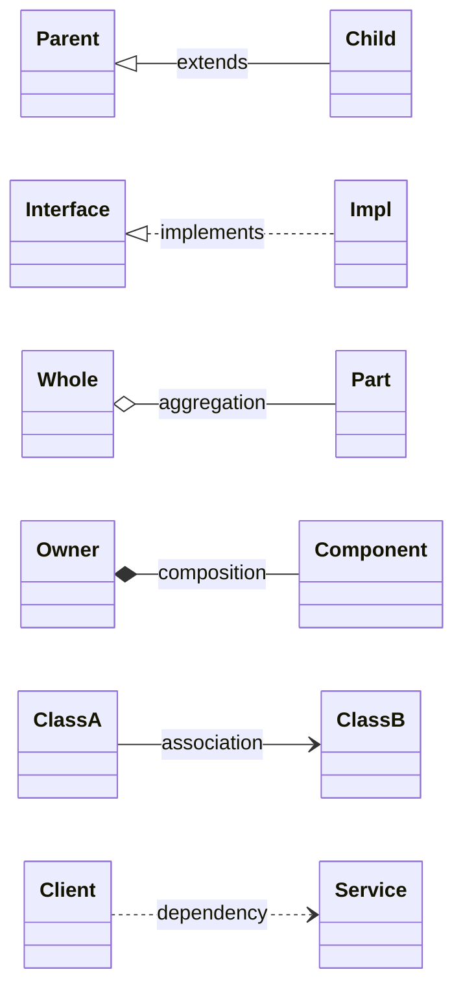

Mermaid 类的基本写法：

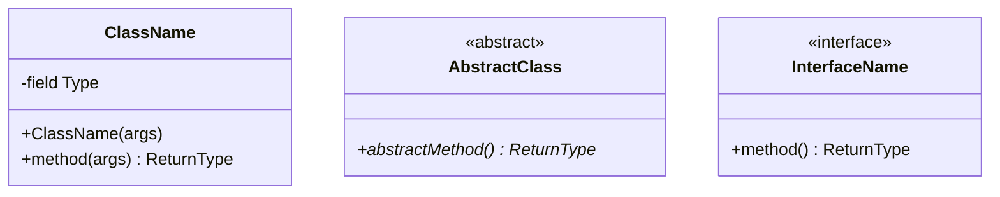

## 4. 设计模式代码模板

### 4.1 单例模式 Singleton

常见题眼：Only one instance、只允许创建一个对象、`StudentInfo`、`ImgResource`、`PrintSpooler`。

Mermaid 通用类图：

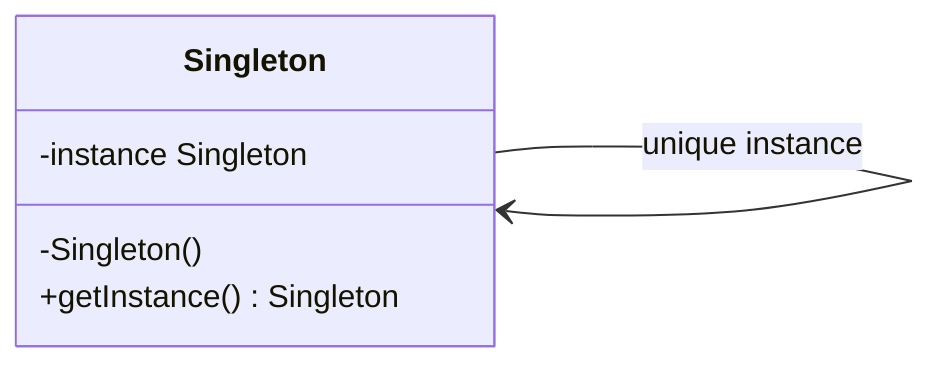

历年案例：`StudentInfo` / `ImgResource` 只允许创建一个对象。

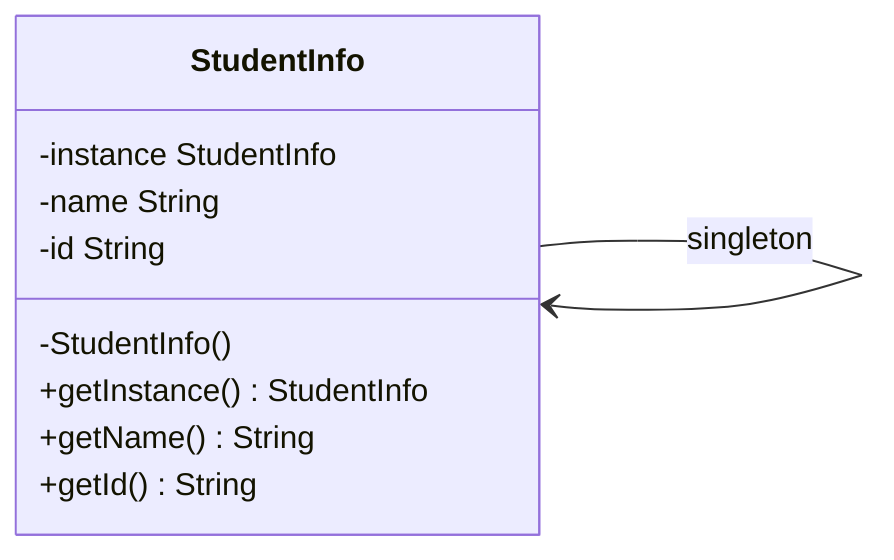

饿汉式：

```java
class StudentInfo {
    private static final StudentInfo INSTANCE = new StudentInfo();

    private String name;
    private String id;

    private StudentInfo() {
    }

    public static StudentInfo getInstance() {
        return INSTANCE;
    }

    public String getName() { return name; }
    public String getId() { return id; }
}
```

懒汉式：

```java
class StudentInfo {
    private static StudentInfo instance;

    private StudentInfo() {
    }

    public static StudentInfo getInstance() {
        if (instance == null) {
            instance = new StudentInfo();
        }
        return instance;
    }
}
```

线程安全懒汉式：

```java
class StudentInfo {
    private static StudentInfo instance;

    private StudentInfo() {
    }

    public static synchronized StudentInfo getInstance() {
        if (instance == null) {
            instance = new StudentInfo();
        }
        return instance;
    }
}
```

固定数量实例，也就是 2016A 中“如果需要 2 个 PrintSpooler 对象”的变体：

```java
class PrintSpooler {
    private static final PrintSpooler[] INSTANCES = {
        new PrintSpooler(), new PrintSpooler()
    };
    private static int index = 0;

    private PrintSpooler() {
    }

    public static PrintSpooler getInstance() {
        PrintSpooler obj = INSTANCES[index];
        index = (index + 1) % INSTANCES.length;
        return obj;
    }
}
```

UML 要点：

```text
Singleton
--------------------------------
- instance: Singleton {static}
- Singleton()
+ getInstance(): Singleton {static}
```

### 4.2 策略模式 Strategy

常见题眼：多个算法可切换、排序策略、折扣策略、利率策略、运行时动态切换、easy to add other methods。

Mermaid 通用类图：

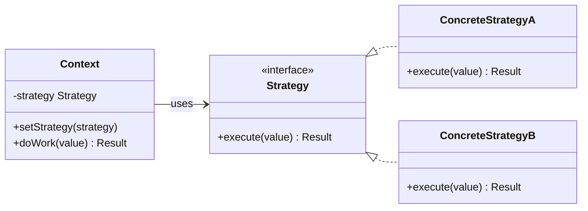

历年案例一：2024A 电商订单折扣系统。

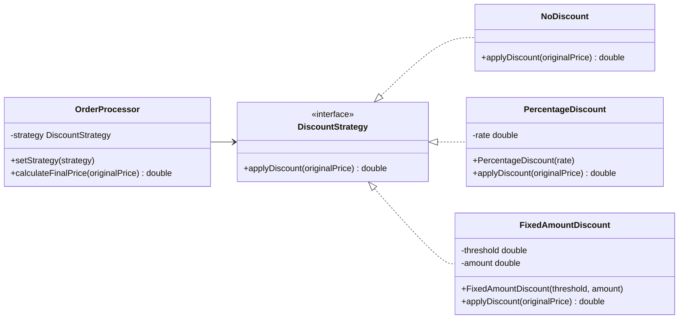

历年案例二：2022A 数组排序系统。

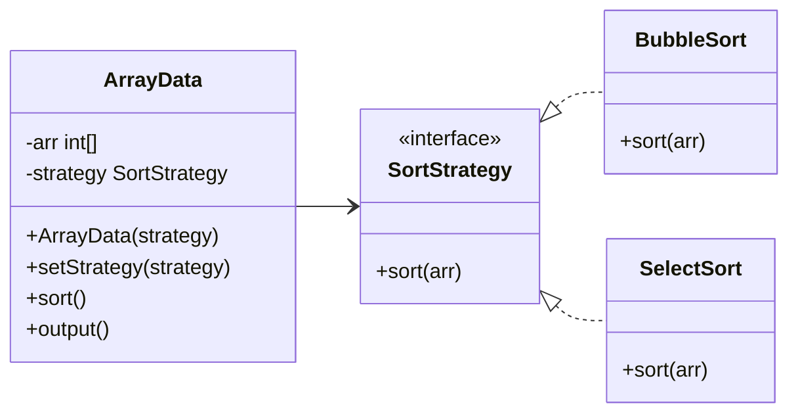

通用模板：

```java
interface Strategy {
    double execute(double value);
}

class ConcreteStrategyA implements Strategy {
    public double execute(double value) {
        return value;
    }
}

class ConcreteStrategyB implements Strategy {
    public double execute(double value) {
        return value * 0.8;
    }
}

class Context {
    private Strategy strategy;

    public void setStrategy(Strategy strategy) {
        this.strategy = strategy;
    }

    public double doWork(double value) {
        return strategy.execute(value);
    }
}

class Test {
    public static void main(String[] args) {
        Context context = new Context();
        context.setStrategy(new ConcreteStrategyB());
        System.out.println(context.doWork(200));
    }
}
```

2024A 折扣系统模板：

```java
interface DiscountStrategy {
    double applyDiscount(double originalPrice);
}

class NoDiscount implements DiscountStrategy {
    public double applyDiscount(double originalPrice) {
        return originalPrice;
    }
}

class PercentageDiscount implements DiscountStrategy {
    private double rate;

    public PercentageDiscount(double rate) {
        this.rate = rate;
    }

    public double applyDiscount(double originalPrice) {
        return originalPrice * rate;
    }
}

class FixedAmountDiscount implements DiscountStrategy {
    private double threshold;
    private double amount;

    public FixedAmountDiscount(double threshold, double amount) {
        this.threshold = threshold;
        this.amount = amount;
    }

    public double applyDiscount(double originalPrice) {
        if (originalPrice >= threshold) {
            return originalPrice - amount;
        }
        return originalPrice;
    }
}

class OrderProcessor {
    private DiscountStrategy strategy = new NoDiscount();

    public void setStrategy(DiscountStrategy strategy) {
        this.strategy = strategy;
    }

    public double calculateFinalPrice(double originalPrice) {
        return strategy.applyDiscount(originalPrice);
    }
}

class Test {
    public static void main(String[] args) {
        OrderProcessor order = new OrderProcessor();
        order.setStrategy(new PercentageDiscount(0.8));
        System.out.println(order.calculateFinalPrice(200)); // 160.0
    }
}
```

2022A 排序策略模板：

```java
interface SortStrategy {
    void sort(int[] arr);
}

class BubbleSort implements SortStrategy {
    public void sort(int[] arr) {
        for (int i = 0; i < arr.length - 1; i++) {
            for (int j = 0; j < arr.length - 1 - i; j++) {
                if (arr[j] > arr[j + 1]) {
                    int temp = arr[j];
                    arr[j] = arr[j + 1];
                    arr[j + 1] = temp;
                }
            }
        }
    }
}

class SelectSort implements SortStrategy {
    public void sort(int[] arr) {
        for (int i = 0; i < arr.length - 1; i++) {
            int min = i;
            for (int j = i + 1; j < arr.length; j++) {
                if (arr[j] < arr[min]) {
                    min = j;
                }
            }
            int temp = arr[i];
            arr[i] = arr[min];
            arr[min] = temp;
        }
    }
}

class ArrayData {
    private int[] arr = new int[10];
    private SortStrategy strategy;

    public ArrayData(SortStrategy strategy) {
        this.strategy = strategy;
        Random random = new Random();
        for (int i = 0; i < arr.length; i++) {
            arr[i] = random.nextInt(100) + 1;
        }
    }

    public void setStrategy(SortStrategy strategy) {
        this.strategy = strategy;
    }

    public void sort() {
        strategy.sort(arr);
    }

    public void output() {
        System.out.println(Arrays.toString(arr));
    }
}
```

UML 要点：

```text
Context --> Strategy
Strategy <|.. ConcreteStrategyA
Strategy <|.. ConcreteStrategyB
```

### 4.3 装饰器模式 Decorator

常见题眼：动态添加功能、任意组合、包装已有对象、不改原类扩展行为。2024B 咖啡加牛奶/糖、2017A `DeceleratingBall` 都是典型装饰器。

Mermaid 通用类图：

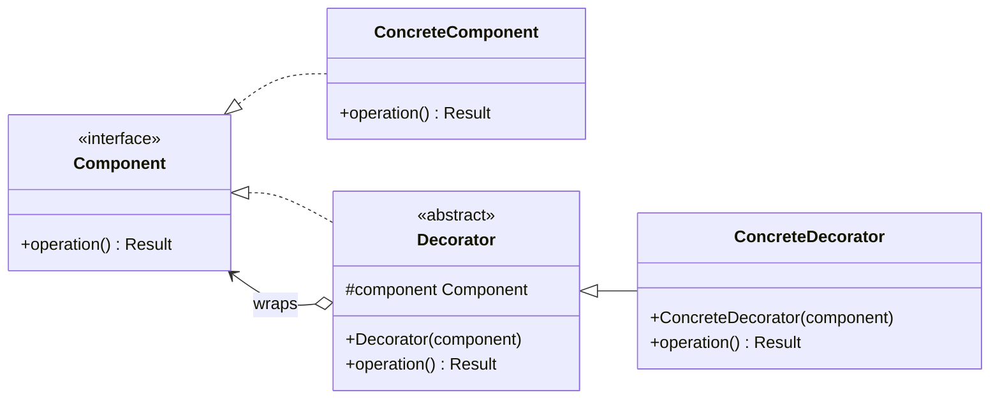

历年案例一：2024B 咖啡加配料。

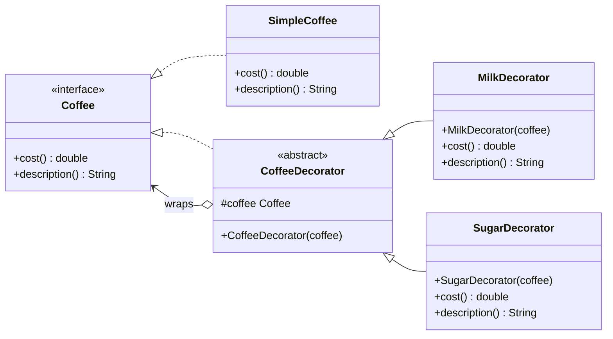

历年案例二：2017A 减速小球 `DeceleratingBall` 包装普通小球。

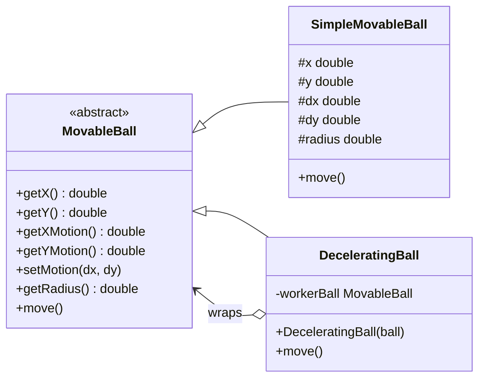

通用模板：

```java
interface Component {
    String operation();
}

class ConcreteComponent implements Component {
    public String operation() {
        return "base";
    }
}

abstract class Decorator implements Component {
    protected Component component;

    public Decorator(Component component) {
        this.component = component;
    }

    public String operation() {
        return component.operation();
    }
}

class ConcreteDecorator extends Decorator {
    public ConcreteDecorator(Component component) {
        super(component);
    }

    public String operation() {
        return super.operation() + " + extra";
    }
}
```

2024B 咖啡系统模板：

```java
interface Coffee {
    double cost();
    String description();
}

class SimpleCoffee implements Coffee {
    public double cost() {
        return 5.0;
    }

    public String description() {
        return "Simple Coffee";
    }
}

abstract class CoffeeDecorator implements Coffee {
    protected Coffee coffee;

    public CoffeeDecorator(Coffee coffee) {
        this.coffee = coffee;
    }
}

class MilkDecorator extends CoffeeDecorator {
    public MilkDecorator(Coffee coffee) {
        super(coffee);
    }

    public double cost() {
        return coffee.cost() + 0.5;
    }

    public String description() {
        return coffee.description() + ", Milk";
    }
}

class SugarDecorator extends CoffeeDecorator {
    public SugarDecorator(Coffee coffee) {
        super(coffee);
    }

    public double cost() {
        return coffee.cost() + 0.2;
    }

    public String description() {
        return coffee.description() + ", Sugar";
    }
}

class Test {
    public static void main(String[] args) {
        Coffee c1 = new SimpleCoffee();
        Coffee c2 = new MilkDecorator(c1);
        Coffee c3 = new SugarDecorator(c2);

        System.out.println("Cost: " + c1.cost() + ", Description: " + c1.description());
        System.out.println("Cost: " + c2.cost() + ", Description: " + c2.description());
        System.out.println("Cost: " + c3.cost() + ", Description: " + c3.description());
    }
}
```

UML 要点：

```text
Component <|.. ConcreteComponent
Component <|.. Decorator
Decorator o--> Component
Decorator <|-- ConcreteDecorator
```

### 4.4 组合模式 Composite

常见题眼：树形结构、整体和部分一致处理、公司-部门、菜单-菜单项、文件夹-文件。

Mermaid 通用类图：

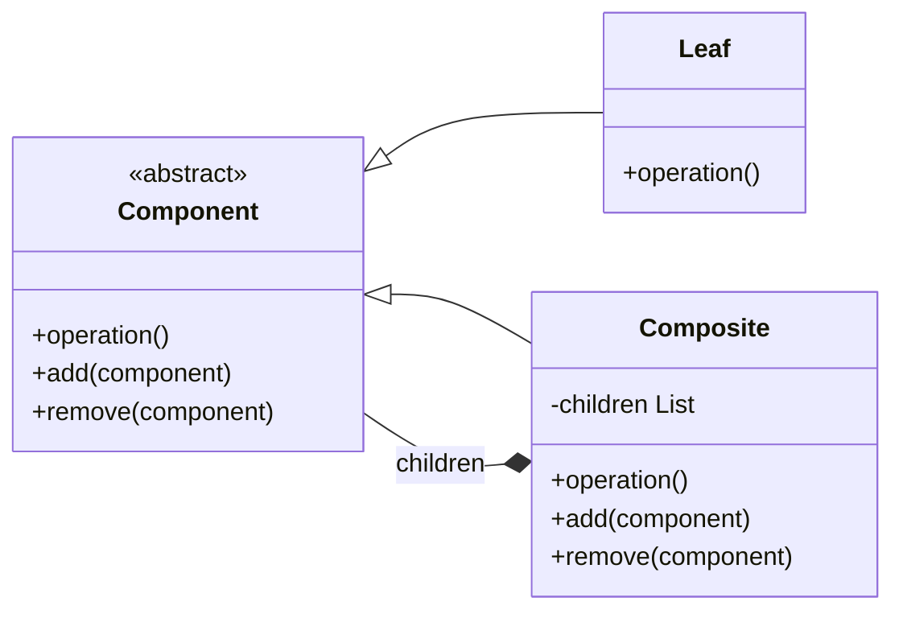

历年案例：2022B 公司-部门组织树。

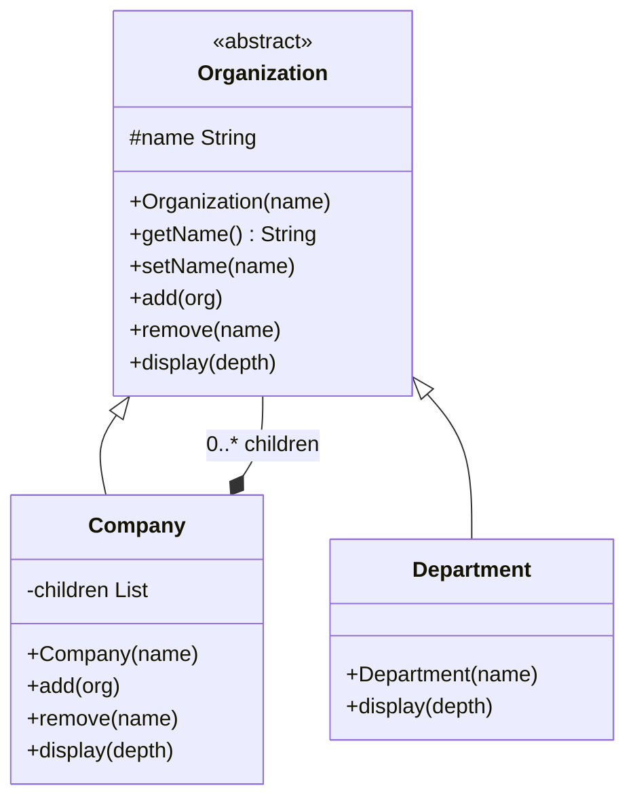

2022B 公司组织结构模板：

```java
import java.util.*;

abstract class Organization {
    protected String name;

    public Organization(String name) {
        this.name = name;
    }

    public String getName() { return name; }
    public void setName(String name) { this.name = name; }

    public void add(Organization org) {
        throw new UnsupportedOperationException();
    }

    public void remove(String name) {
        throw new UnsupportedOperationException();
    }

    public abstract void display(int depth);
}

class Department extends Organization {
    public Department(String name) {
        super(name);
    }

    public void display(int depth) {
        printPrefix(depth);
        System.out.println(name);
    }

    private void printPrefix(int depth) {
        for (int i = 0; i < depth; i++) {
            System.out.print("----");
        }
    }
}

class Company extends Organization {
    private ArrayList<Organization> children = new ArrayList<>();

    public Company(String name) {
        super(name);
    }

    public void add(Organization org) {
        children.add(org);
    }

    public void remove(String name) {
        Iterator<Organization> it = children.iterator();
        while (it.hasNext()) {
            if (it.next().getName().equals(name)) {
                it.remove();
                return;
            }
        }
    }

    public void display(int depth) {
        printPrefix(depth);
        System.out.println(name);
        for (Organization child : children) {
            child.display(depth + 1);
        }
    }

    private void printPrefix(int depth) {
        for (int i = 0; i < depth; i++) {
            System.out.print("----");
        }
    }
}
```

UML 要点：

```text
Component <|-- Leaf
Component <|-- Composite
Composite *--> Component
```

### 4.5 工厂 + DAO 模式

常见题眼：不同数据库访问类、`IUserDAO`、`OracleUserDAO`、提高扩展性、RegisterForm 把 UserDTO 传给 DAO。

Mermaid 通用类图：

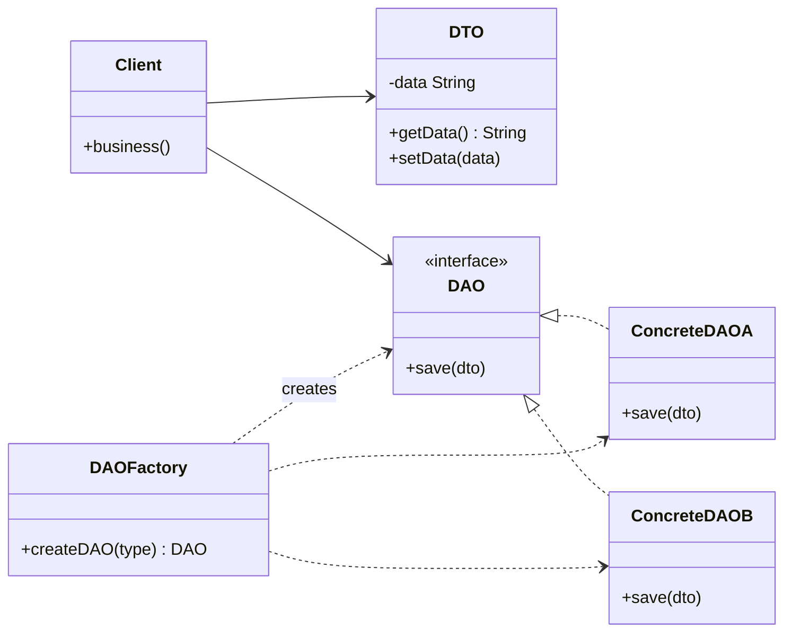

历年案例：2020A 注册系统，`RegisterForm` 通过 `UserDTO` 把用户信息交给不同数据库的 DAO。

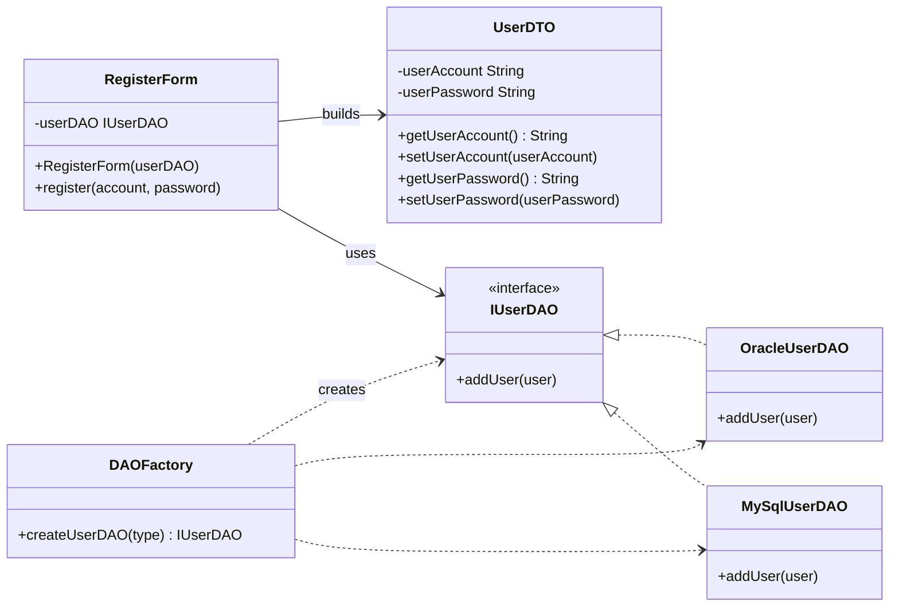

```java
class UserDTO {
    private String userAccount;
    private String userPassword;

    public String getUserAccount() { return userAccount; }
    public void setUserAccount(String userAccount) { this.userAccount = userAccount; }

    public String getUserPassword() { return userPassword; }
    public void setUserPassword(String userPassword) { this.userPassword = userPassword; }
}

interface IUserDAO {
    void addUser(UserDTO user);
}

class OracleUserDAO implements IUserDAO {
    public void addUser(UserDTO user) {
        System.out.println("Add user to Oracle: " + user.getUserAccount());
    }
}

class MySqlUserDAO implements IUserDAO {
    public void addUser(UserDTO user) {
        System.out.println("Add user to MySQL: " + user.getUserAccount());
    }
}

class DAOFactory {
    public static IUserDAO createUserDAO(String type) {
        if ("oracle".equalsIgnoreCase(type)) {
            return new OracleUserDAO();
        }
        if ("mysql".equalsIgnoreCase(type)) {
            return new MySqlUserDAO();
        }
        throw new IllegalArgumentException("Unknown database type");
    }
}

class RegisterForm {
    private IUserDAO userDAO;

    public RegisterForm(IUserDAO userDAO) {
        this.userDAO = userDAO;
    }

    public void register(String account, String password) {
        UserDTO user = new UserDTO();
        user.setUserAccount(account);
        user.setUserPassword(password);
        userDAO.addUser(user);
    }
}
```

UML 要点：

```text
RegisterForm --> UserDTO
RegisterForm --> IUserDAO
IUserDAO <|.. OracleUserDAO
IUserDAO <|.. MySqlUserDAO
DAOFactory ..> IUserDAO
```

### 4.6 观察者模式 Observer / Java GUI 事件监听

常见题眼：Java GUI、按钮点击、事件源、监听器、`ActionListener`、`actionPerformed(ActionEvent e)`。

考试中 GUI 常说的两个模式：

1. 观察者模式：事件源维护监听器，事件发生时通知监听器。
2. 组合模式：GUI 容器中包含组件，例如 `Frame` / `Panel` 包含 `Button` / `TextField`。

Mermaid 通用类图：

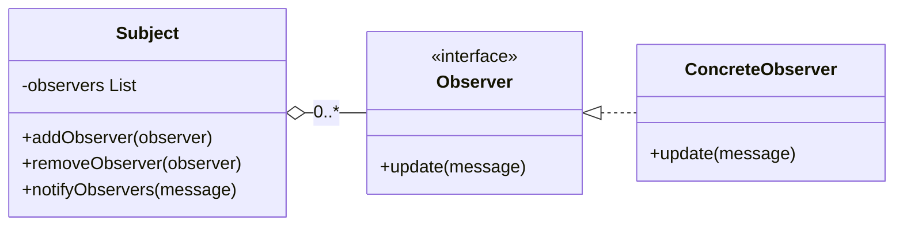

Java GUI 事件监听案例图：

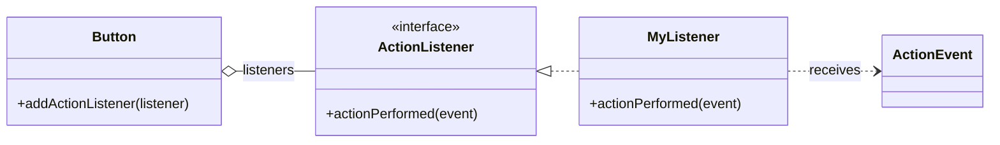

观察者通用模板：

```java
import java.util.*;

interface Observer {
    void update(String message);
}

class Subject {
    private ArrayList<Observer> observers = new ArrayList<>();

    public void addObserver(Observer observer) {
        observers.add(observer);
    }

    public void removeObserver(Observer observer) {
        observers.remove(observer);
    }

    public void notifyObservers(String message) {
        for (Observer observer : observers) {
            observer.update(message);
        }
    }
}

class ConcreteObserver implements Observer {
    public void update(String message) {
        System.out.println("receive: " + message);
    }
}
```

Java GUI 事件模板：

```java
import java.awt.*;
import java.awt.event.*;

class GuiTest {
    public static void main(String[] args) {
        Frame frame = new Frame("Test");
        Button button = new Button("OK");

        button.addActionListener(new ActionListener() {
            public void actionPerformed(ActionEvent e) {
                System.out.println("Button clicked");
            }
        });

        frame.add(button);
        frame.setSize(300, 200);
        frame.setVisible(true);
    }
}
```

### 4.7 简单 MVC 模板

常见题眼：注册界面、DTO、DAO、控制类，或需要把界面、数据、业务分离。

Mermaid 通用类图：

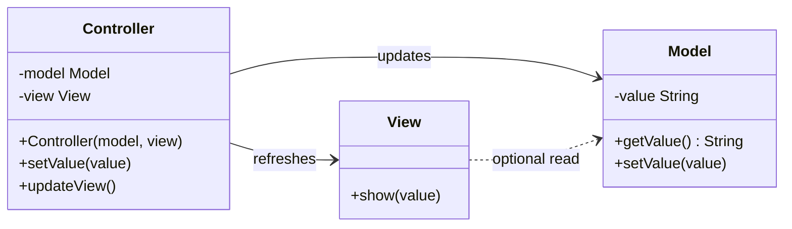

```java
class Model {
    private String value;

    public String getValue() { return value; }
    public void setValue(String value) { this.value = value; }
}

class View {
    public void show(String value) {
        System.out.println(value);
    }
}

class Controller {
    private Model model;
    private View view;

    public Controller(Model model, View view) {
        this.model = model;
        this.view = view;
    }

    public void setValue(String value) {
        model.setValue(value);
    }

    public void updateView() {
        view.show(model.getValue());
    }
}
```

### 4.8 普通继承 + 管理类建模模板

常见题眼：设计一个父类和若干子类，再由系统类/管理类保存对象集合，提供 `add`、`remove`、`display`、`search` 等方法。它不一定是设计模式，但几乎每年 UML 题都会出现。

通用类图：

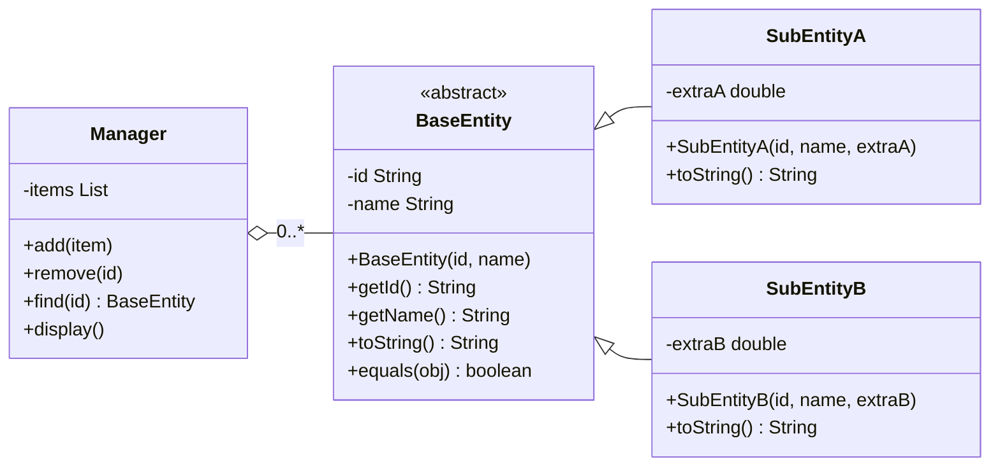

历年案例一：2018A 员工信息管理系统，`ProjectManager` 和 `GeneralStaff` 继承 `Employee`，`EIM` 管理多个员工。

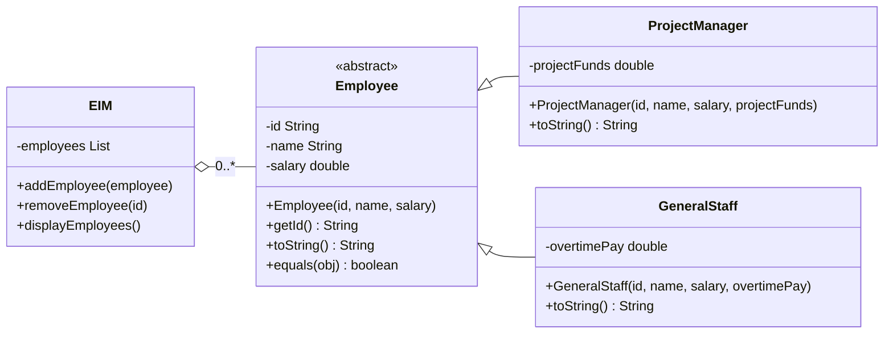

历年案例二：2017B 学位课程成绩判断，`Undergraduate` 和 `Graduate` 继承 `Student`，重写是否通过的判断。

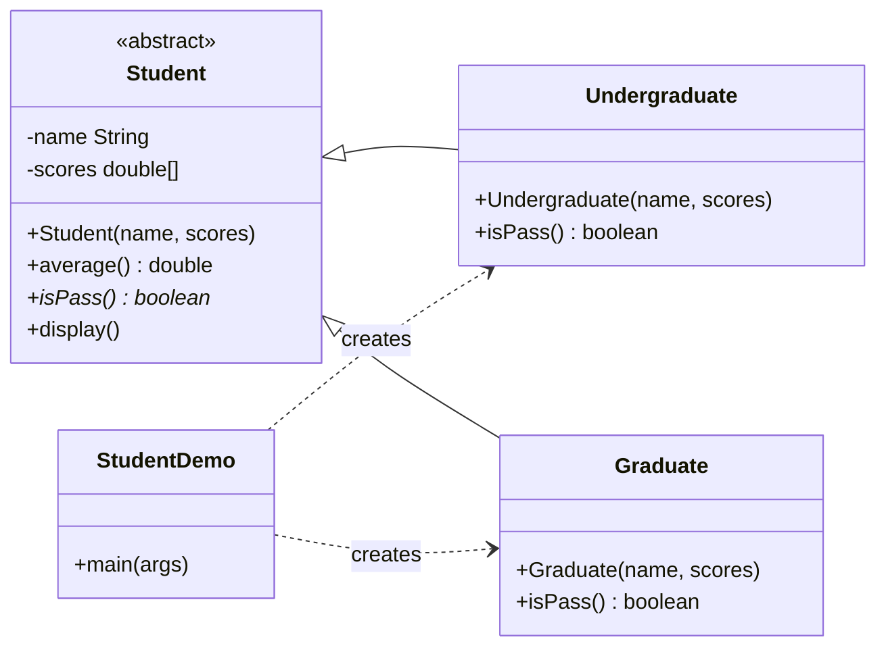

历年案例三：2023B 大学研讨课系统，重点是多重性和中间类 `Enrollment`。

```mermaid
classDiagram
direction LR
class Person {
  -name String
  -address String
  -phone String
  -email String
}
class Professor {
  -salary double
}
class Student {
  -averageMark double
  +getSeminars() List
}
class Seminar {
  -name String
  -number String
}
class BachelorSeminar {
  +withdrawAllowed() boolean
}
class MasterSeminar {
  +withdrawAllowed() boolean
}
class Enrollment {
  -currentMark double
  -finalMark double
  +getCurrentMark() double
  +getFinalMark() double
}
Person <|-- Professor
Person <|-- Student
Seminar <|-- BachelorSeminar
Seminar <|-- MasterSeminar
Student "1" -- "0..*" Enrollment
Seminar "1" -- "0..*" Enrollment
Professor "1..3" -- "0..*" Seminar : teaches
```

## 5. 常见 UML + 代码综合题解题模板

遇到“请画类图并写代码”时，可以直接按这个顺序写：

```text
1. Pattern name:
   Strategy / Singleton / Decorator / Composite / Factory + DAO

2. Classes:
   Interface or abstract class:
   - defines common operations

   Concrete classes:
   - implement different behavior

   Context / manager class:
   - has a reference to the interface or collection
   - add/remove/set/display/business methods

   Test:
   - create objects
   - call methods
   - print result

3. UML:
   - inheritance / implementation arrow
   - association from context to interface
   - multiplicity, especially 1, 0..*, 1..*
```

## 6. 按题目关键词快速选模式

| 题目关键词 | 优先模式 |
| --- | --- |
| only one instance、唯一对象、getInstance | Singleton |
| multiple algorithms、dynamic switch、sorting / discount / interest strategy | Strategy |
| dynamically adding condiments/features、任意组合包装 | Decorator |
| tree structure、company-department、part-whole、统一处理叶子和容器 | Composite |
| different databases、DAO interface、create concrete DAO | Factory + DAO |
| GUI event、listener、notify、button click | Observer |
| view / model / controller、界面与数据分离 | MVC |

## 7. 最容易丢分的细节

1. `equals` 必须写 `public boolean equals(Object obj)`，并处理 `null`、类型判断、强转。
2. 接口方法实现必须是 `public`。
3. 抽象类不能直接 `new`，非抽象子类必须实现所有抽象方法。
4. `ArrayList` 删除元素时不要用增强 `for` 直接删，优先用 `Iterator.remove()` 或普通倒序循环。
5. UML 中继承箭头指向父类，接口实现是虚线空心三角。
6. 组合/聚合的菱形在“整体”一端。
7. 策略模式的核心不是 `if-else`，而是“Context 持有 Strategy 接口引用”。
8. 装饰器模式的核心是“Decorator 和被装饰对象实现同一个接口，Decorator 内部持有该接口引用”。
9. 组合模式的核心是“Composite 内部保存 `List<Component>`，Leaf 和 Composite 都继承 Component”。
10. 写综合题时一定要补 `Test`，大题经常明确要求创建对象并输出结果。
